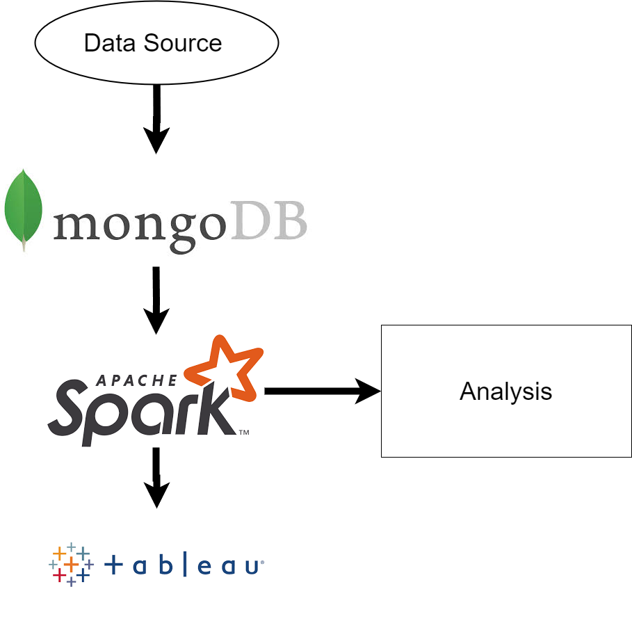
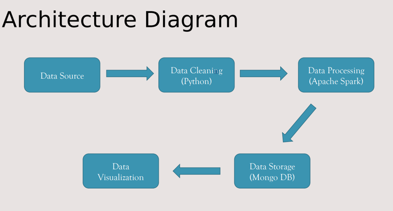

# Flight Delay Analysis

## Project Statement and Description
The aviation industry is pivotal in connecting businesses and people worldwide, yet flight delays due to extreme weather and other factors pose significant challenges for airlines and passengers alike. According to a study by UC Berkeley, domestic flight delays cost the US economy $38.3 billion in 2019, with airline customers bearing about half of this cost. Therefore, accurate analysis of flight delays is crucial for mitigating their negative impacts on both passengers and airlines.

This project aims to analyze flight delays caused by various factors, enabling airlines to take proactive measures to minimize delays and helping passengers plan their journeys more effectively.

## Tools Used

## Workflow

1. **Data Download**:
   - Download the data from [Harvard Dataverse](https://dataverse.harvard.edu/dataset.xhtml?persistentId=doi:10.7910/DVN/HG7NV7). The dataset spans 12 years, from 1987 to 1998.

2. **Data Upload and Aggregation**:
   - Upload all datasets into MongoDB Compass.
   - Create an aggregated dataset by filtering flight data from the following 20 airports:
     - IAD ‐ Washington, DC
     - ORD ‐ Chicago, IL
     - LAS ‐ Las Vegas, NV
     - BWI ‐ Baltimore Washington Airport
     - SLC ‐ Salt Lake City, UT
     - BNA ‐ Nashville, TN
     - JFK ‐ NYC Airport
     - SEA ‐ Seattle, WA
     - CVG ‐ Cincinnati, OH
     - BOS ‐ Boston, MA
     - HOU‐ Houston, TX
     - DTW ‐ Detroit, MI
     - DEN ‐ Denver, CO
     - ORL ‐ Orlando, FL
     - PIT ‐ Pittsburgh, PA
     - MIA ‐ Miami, FL
     - MIA ‐ Miami Airport
     - LAX ‐ Los Angeles Airport
     - SYR - Syracuse Airport
     - LGA - LaGuardia Airport

3. **Data Processing**:
   - Perform data filtering and aggregation using a Jupyter Notebook, which is included along with the source code.
   - The aggregated file contains approximately 3.2 million rows of data from the 20 selected airports.

4. **Data Analysis**:
   - Import the data into Apache Spark using MongoDB Apache Spark integration.
   - Conduct a comprehensive analysis using Spark.

For a detailed analysis, please refer to the attached presentation file: `Flight_Delay_Analysis_Prediction`.
